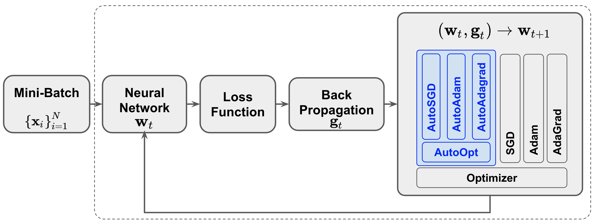

# AutoOpt

This package implements various optimizers with automatic and simultaneous
adjustment of the learning rate and the momentum. The AutoOpt package can be used
in a deep learning training instead of the regular optimizers that are available 
in the PyTorch framework. The mini-batch flow in a training is shown in the below 
figure.



## Installation

This package is built and tested in Python 3.6. Create
a `venv` and install the dependencies as follows:

```bash
python3 -m venv .env
source .env/bin/activate
pip install --upgrade pip
pip install torch torchvision
```

Now install the AutoOpt package from its source repository:

```bash
pip install [autoopt-path]
```

## Examples

Please see the sample code provided in the `examples` folder to understand
how this package can be used in training of various ML models.

## Citing AutoOpt paper

Please cite the 
[AutoOpt paper](https://arxiv.org/pdf/1908.07607.pdf) 
if you are using it in a scientific publication.

```bibtex
@inproceedings{9053316,
  author={T. {Lancewicki} and S. {Kopru}},
  booktitle={ICASSP 2020 - 2020 IEEE International Conference on Acoustics, Speech and Signal Processing (ICASSP)}, 
  title={Automatic and Simultaneous Adjustment of Learning Rate and Momentum for Stochastic Gradient-based Optimization Methods}, 
  year={2020},
  volume={},
  number={},
  pages={3127-3131}
}
```

## License

Copyright 2019 eBay Inc.

Licensed under the Apache License, Version 2.0 (the "License"); you may not use this 
file except in compliance with the License. You may obtain a copy of the License at

https://www.apache.org/licenses/LICENSE-2.0

Unless required by applicable law or agreed to in writing, software distributed under the
License is distributed on an "AS IS" BASIS, WITHOUT WARRANTIES OR CONDITIONS OF ANY KIND,
either express or implied. See the License for the specific language governing permissions
and limitations under the License.

## Third Party Code Attribution

This software contains code licensed by third parties.
See LICENSE.txt.
